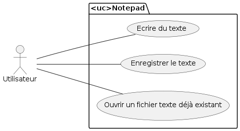

## Application C# - Notepad ~ Mouaz MOHAMED
Notepad (ou Bloc-Notes) est une application en C# avec Windows Forms et le framework Microsoft .NET permettant d'écrire du texte dans l'application et de l'enregistrer sous format texte (.txt) ou encore d'ouvrir un fichier texte existant, de le modifier et de l'enregistrer. Il est très similaire à l'application Bloc-Notes de Microsoft™.

---

## Diagramme des cas d'utilisation (User Case Diagram) de mon application


---

## Écrire du texte
Nous pouvons écrire du texte dans mon application.<br>


---

## Enregistrer le texte
Nous pouvons l'enregistrer sous format texte (.txt) en cliquant sur l'onglet <strong>fichier</strong> ou en utilisant le raccourci <strong>Ctrl+R</strong>.<br>


---

## Ouverture dans l'application Bloc-Notes de Microsoft™
Nous pouvons ouvrir le texte que nous avons enregistré sur l'application Bloc-Notes de Microsoft™.<br>


---

## Ouvrir un fichier texte déjà existant dans mon application
Nous pouvons ouvrir un fichier texte déjà existant dans mon application comme le fichier que nous avons crée auparavant en cliquant sur l'onglet <strong>Fichier</strong> ou en utilisant le raccourci <strong>Ctrl+O</strong>. Et par la suite nous pouvons le modifier et l'enregistrer.<br>


## Code source du Design Windows Forms
``` csharp
public partial class MyNotepad : Form
    {
        public Fprincipal()
        {
            InitializeComponent();
            mi_exit.Click += mi_exit_Click;
        }

        private void Mi_save_Click(object sender, EventArgs e)
        {
            throw new NotImplementedException();
        }

        private void Mi_open_Click(object sender, EventArgs e)
        {
            throw new NotImplementedException();
        }

        private void M_fichier_Click(object sender, EventArgs e)
        {
            throw new NotImplementedException();
        }

        private void Mi_saveas_Click(object sender, EventArgs e)
        {
            throw new NotImplementedException();
        }

        private void Mi_new_Click(object sender, EventArgs e)
        {
            throw new NotImplementedException();
        }

        private void Form1_Load(object sender, EventArgs e)
        {}

        private void m_fichier_Click(object sender, EventArgs e)
        {}

        private void mi_open_Click(object sender, EventArgs e)
        {
            if(open_file.ShowDialog()==DialogResult.OK)
            {
                rt_texte.LoadFile(open_file.FileName, RichTextBoxStreamType.PlainText);
            }
        }

        private void mi_saveas_Click(object sender, EventArgs e)
        {
            if (save_file.ShowDialog() == DialogResult.OK)
            {
                rt_texte.SaveFile(save_file.FileName, RichTextBoxStreamType.PlainText);
            }
        }

        private void mi_exit_Click(object sender, EventArgs e)
        {
            this.Close();
        }

        private void rt_texte_TextChanged(object sender, EventArgs e)
        {}

        private void open_file_FileOk(object sender, CancelEventArgs e)
        {
            rt_texte.LoadFile(open_file.FileName, RichTextBoxStreamType.PlainText);
        }

        private void save_file_FileOk(object sender, CancelEventArgs e)
        {
             rt_texte.SaveFile(save_file.FileName, RichTextBoxStreamType.PlainText);
        }

        private void mi_new_Click(object sender, EventArgs e)
        {
            Fprincipal fp = new Fprincipal();
            fp.Show();
        }

        private void mi_save_Click(object sender, EventArgs e)
        {
            string savefile = save_file.FileName;
        }
    }
```